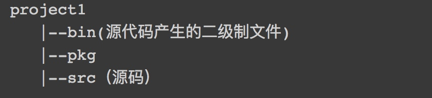
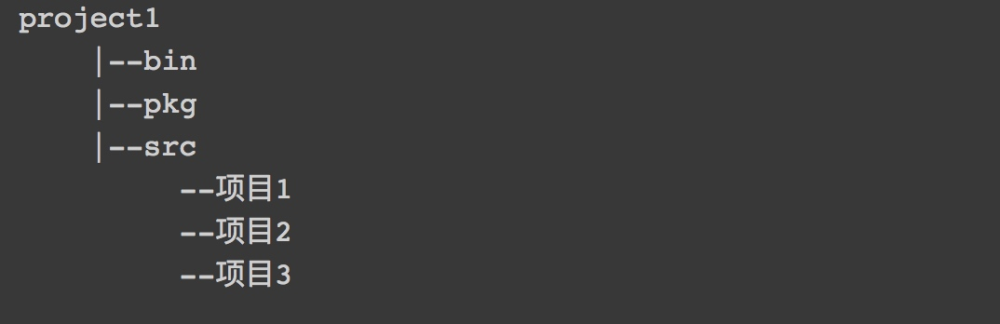

# 1.前言
> 以前学习的go语言,现在看来又忘的差不多了。个人感觉任何一门语言,构建安装以及项目目录结构这块比较重要。所以先讲一下go语言的环境搭建以及工程目录结构

## 2.环境搭建
+ 1.mac 下载go1.7 pkg 自动安装地址
https://storage.googleapis.com/golang/go1.7.darwin-amd64.pkg
+ 2 设置GOPATH,GOROOT环境变量
   - GOPATH 为你项目的所在目录,安装go的规范希望每个项目对应一个目录。比如你有的/user/local下有3个项目project1,project2,project3 那么GOPATH=/usr/local/project1;/usr/local/project2;/usr/local/project3
   项目和项目之间用分号隔离开来。
   - GOROOT 为你安装go的安装路径

## 3.工程结构


但是最佳实践不是这样玩的。如果这样玩意味着我每新增加一个项目我需要更新GOPATH 即在GOPATH路径里面加上项目所在路径。

最佳实践为
整个工作空间就一个项目


观察很多开源项目发现他们的项目里面没有src目录就可以猜测到他们也是这么完的。

## 4 包的约定
1.同一个目录下go文件的package要一致即

在go1 目录下 go1.go go2.go 的package 必须一样

```go
package go2

import (
	"fmt"
)

func Adds() {
	fmt.Println("hello world are you  ok")
}

func main() {
	fmt.Println("hello world")
}

```

2.同一个目录下,go 文件里的方法不能相同

3.如果同一个目录下 go文件里面的package 为main，则该目录下go文件中必须要有一个文件包含有
main函数

4.Go语言约定import path（导入路径）的最后一个元素是包名字。

5.import 导入的是目录的名称而不是go 文件里面的package 所声明的名称,但使用的时候是使用package 声明的名称

## 5 go build / go install / go run /go get

+  go build 即编译源码文件,如果 编译的文件为源码文件即不含main函数的文件,那么在pkg目录下或者当前目录下产生任何文件,如果编译了含有mian函数的包或者文件则会产生可执行文件

注意我们可以在任意目录下执行go build 只要我们配置了GOPATH 路径。比如我们在/user/local 路径下
执行 go build github.com/astaxie/bat 这个实际是找$GOPATH/scr  在拼接 github.com/astaxie/bat 这个路径去找的


+  go install 即对于不含有main函数的包,install 会在pkg目录下产生一个.a文件夹,同时在bin目录下生成一个可执行文件。
注意go install 文件后面不能接文件,需要接文件夹即时包才行。即不能 go install a.go 这样只会报错`go install: no install location for .go files listed on command line (GOBIN not set)` 
想看详细的信息可以 go install -v -work 

+ go run 


