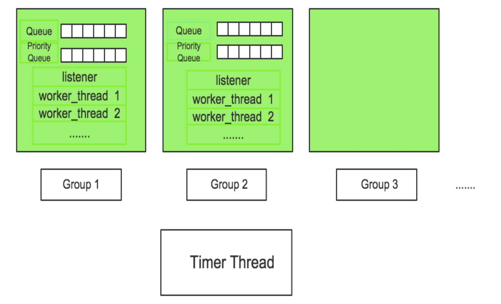
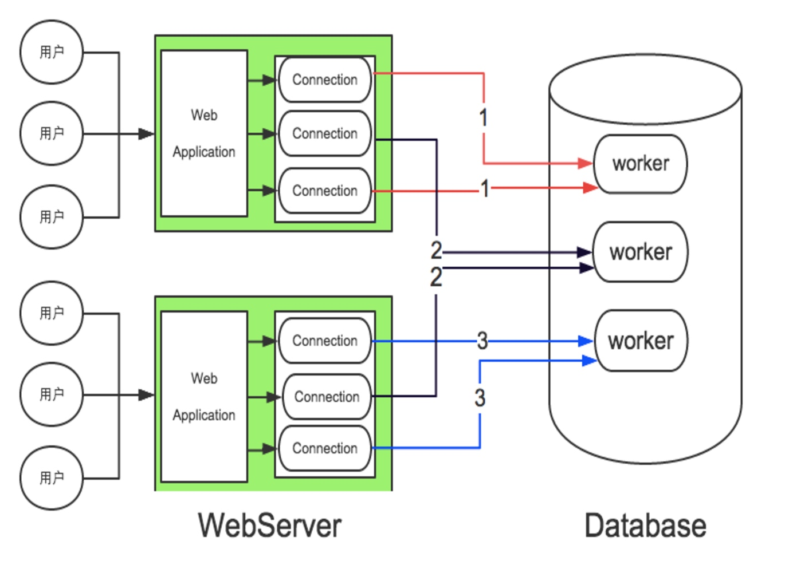
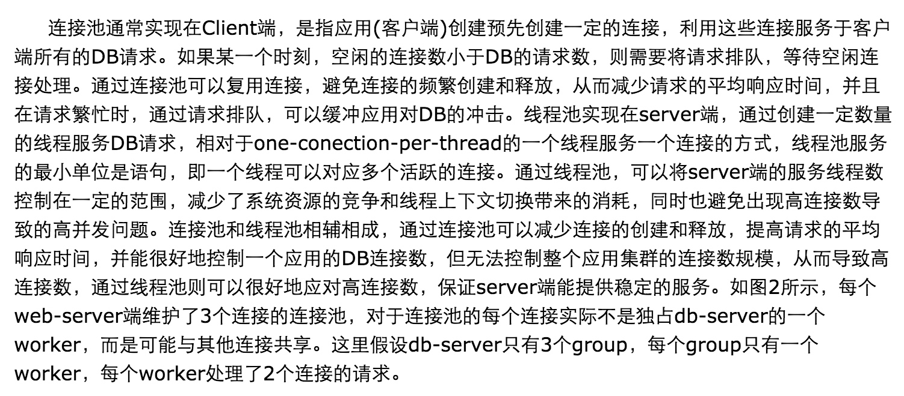

# mysql学习
## mysql server架构
+ mysql server端组成
  - 连接管理（认证，校验）
  - sql查询语法解析，优化
  - 存储引擎层（与文件系统打交道的） 
+ 服务端线程池模型

按照我的理解是这样。
   1.listener线程监听套接字，阻塞等待。
   2.如果有，从阻塞中恢复，根据连接的优先级决定放入普通队列还是优先级队列。
   3.然后worker线程从队列中取连接请求进行处理。处理的时候会创建一个新的connection对象，根据worker线程id%group_count 确定connection对象分配到哪个group中。
   4.最后又个timer thread 线程，主要是进行一些检查工作，比如检查是否有链接超时等
   
  总结：其实有点类似netty的线程模型结构,处理连接的线程，还有一个处理io 编码解码的线程，即boss线程和worker线程。然后在netty中记忆中多个boss线程构成一个group。哈哈没想到看mysql 服务端的线程池也是这样搞得。只不过多了一个time thread线程。可见基本的套路都一样啊。队列+线程池隔离
  
 + 理解下我们客户端用的连接池和mysql 服务端线程池的关系
 

可以看到，3个连接的连接池，其实是在mysql服务端是一个worker线程可以处理多个连接请求的。
> 理解：
>

