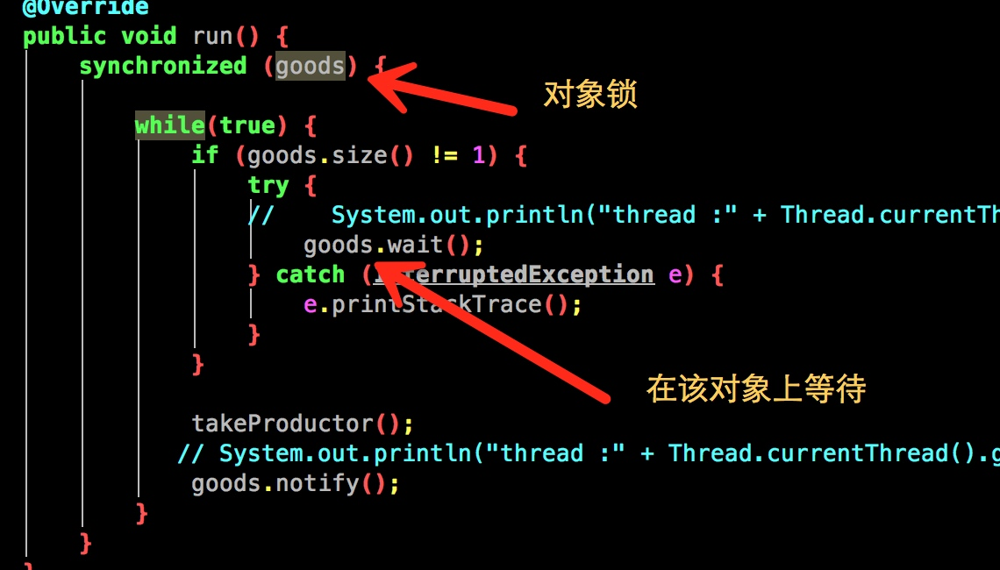

#线程
## 1  线程wait,notify理解
### 1.1 why约定wait,notify需要在同步块里面调用？
首先看如下代码：

	看在调用wait的时候,需要先进入synchronized区域里面，即获取对象goods的锁，表示当前线程在goods对象上等待。goods.wait 可以这样理解，表示当前线程向goods发了一个wait信号，goods我们可以看成共享对象，由此可以想到，wait,notify其实就是2个线程通信，通过共享对象goods进行通信,所以在jdk里面需要一个线程在该对象wait,必须通过同一个对象发送notify信号才能唤醒。有木有深刻get到？这个其实是jvm不同线程通信的模型，通过共享内存通信。在想一下,这个模式在我们身边随处可见呐。比如2个系统要进行通信,常见做法是通过消息队列,数据库也可以。那么这个消息队列和数据库就相当于共享对象了。有木有？
	


### 1.2 为什么wait,notify方法在Object类里面？
这个很好理解啊，你想一下,看上面代码，线程等待被唤醒,其实就是个通信过程。通过共享对象进行通信,那么上面的理解就为A线程拿到对象goods的锁了,然后给goods.wait，即给goods发送了一个wait的消息。这个就表示当前线程告诉了goods了，说我要等待了的消息。然后线程A放弃了goods的锁了,等待了。然后另外一个线程B拿到goods的锁,goods.notify即表示,向goods发送一个消息表示要唤醒的消息。那么A线程感知到goods有notify消息的时候,表示有线程要唤醒我,于是就是等待队列切换到可执行队列里面,即具备执行了权限。可见,2个线程等待唤醒，都是通过goods的wait,notify传递信息。即共享对象。那么wait,notify方法肯定是定义在object里面。


## 2 interrupt中断理解
### 2.1 interrupt方法
代码片段
`thread.interrupt()` 该方法表示给thread发一个中断信号，注意理解中断，中断的意思就是阻止当前线程的执行状态，状态有可能是在执行中,有可能是处于wait中,例如线程如果调用了wait,sleep,join，这个时候中断表示使线程从wait状态中醒来。当这个interrupt方法被调用,会将flag置为ture,jdk会扫描该flag,如果发现变量为ture,则响应中断,如果线程之前是wait状态的时候，那么响应中断就是抛出interruptException异常,同时将falg设置为false.如下：
try{
   object.wait() //被中断后会抛出InterruptException异常
}catch(InterruptException){
}
注意调用interrupt只是将flag设置为ture,至于什么时候响应中断那这个是jvm的响应了。jvm响应了是通过抛出异常以及复位中断标记。即throw InterruptException，以及flag=false 操作
  
### 2.2 thread.isInterrupted()
查看线程中断状态。如果调用了thread.interrupt()后，会将状态设置为ture.但有时候我们发现明显我们已经调用thread.interrupt方法,可是为什么thread.isInterrupted方法返回的还是false呢？这里其实可以理解，因为你调用完后,线程响应了中断状态。已经将中断标记复位了，即为false了。
注意：
线程静态方法Thread.interrupted()是线程静态方法
interrupt,`isInterrupted`是属性方法。
## 3 join理解
`thread.join()` 表示的意思线程加入到当前线程中，一定要理解当前线程这个概念，当前线程就是运行thrad.join代码的这个线程，join的意思就是将当前线程阻塞，调度给thread线程运行。但是有个前提条件就是thread必须是alive的。也就是thread必须start状态的。
##4 volaite 关键字理解
voloite只能修饰变量，它的语义是保证线程可见，即将线程的工作内存数据刷新到主内存中去。这个可以根据jvm得内存模型得出来。注意它只能保证可见性，并不能保证线程安全。比如对应`private volaite int x = 4` 比如这个变量，如果有2个线程在对它写，则会有线程安全问题。
比如A线程将x 改为 x+1 即结果为5，线程B,也执行加1操作,由于它读到的x也为4,而值为5是在它后面刷新到主内存，所以对对于线程B而已,加1得到结果也为5.与本该的6不符合。所以也会存在线程安全问题
##5 countdownLatch源码解析
代码

```java
private static final class Sync extends AbstractQueuedSynchronizer {
        private static final long serialVersionUID = 4982264981922014374L;

        Sync(int count) {
            setState(count);
        }

        int getCount() {
            return getState();
        }
  
        //返回0,表示获取到锁,线程可以执行了,如果返回false则表示没有获取到锁,继续阻塞
        protected int tryAcquireShared(int acquires) {
            return (getState() == 0) ? 1 : -1; 
        }

        protected boolean tryReleaseShared(int releases) {
            // Decrement count; signal when transition to zero
            for (;;) {
                int c = getState();
                if (c == 0)
                    return false;
                int nextc = c-1;
                if (compareAndSetState(c, nextc))
                    return nextc == 0;
            }
        }
    }
    //可以看到这个await方法是调用的可中断的获取锁的实现
    // 由此可以看到，await操作只是判断state是否为0,如果不为0继续阻塞
    // 如果为0 则获取执行权限,线程不阻塞获的执行权限
     public void await() throws InterruptedException {
        sync.acquireSharedInterruptibly(1); //《1》
    }
    
     public final void acquireSharedInterruptibly(int arg)
            throws InterruptedException {
        if (Thread.interrupted())
            throw new InterruptedException();
        if (tryAcquireShared(arg) < 0)
            doAcquireSharedInterruptibly(arg);
    }
  
    //sync 是countDownLatch内部实现的一个队列同步器
    //所以我们看到,countDown 操作实际上将state递减操作,直到
    //state为0，
    public void countDown() {
        sync.releaseShared(1);
    }
   
     protected boolean tryReleaseShared(int releases) {
            // Decrement count; signal when transition to zero
            for (;;) {
                int c = getState(); //这个传递的值state就是从countDownLatch构造函数传递进来的
                
                //如果为0,表示还没有获取锁,这个时候release返回false
                if (c == 0) 
                    return false;
                int nextc = c-1;//递减
                if (compareAndSetState(c, nextc))//cas 设置值
                    return nextc == 0;//如果最后减1为0,表示释放成功
            }
        }

```
总结：
 1.await操作就是判断state状态是否为0,为0表示不阻塞。countDownLatch操作则将state状态递减。 这个实现跟AQS关系密切,下次单独写个md解析其实现原理
 2.该实现是可重入的。
##6 semaphore实现

##7 理解voliate 和synchronized的区别
voliate修饰的变量被某个线程更改， 从底层来讲，语义为 将变量从高速缓存刷新到主内存，同时其他线程缓存的变量失效,需要重新从主内存拉取。就这样。
即对其他线程是可见的。
 
 x=1    x=1
 x=2    
 
 
 


 

