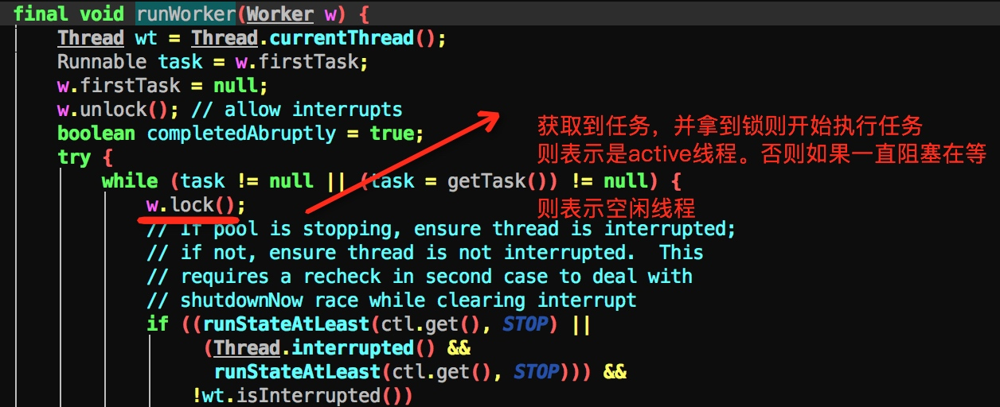

[TOC]

# 线程
## 1  线程wait,notify理解
### 1.1 why约定wait,notify需要在同步块里面调用？
首先看如下代码：

	看在调用wait的时候,需要先进入synchronized区域里面，即获取对象goods的锁，表示当前线程在goods对象上等待。goods.wait 可以这样理解，表示当前线程向goods发了一个wait信号，goods我们可以看成共享对象，由此可以想到，wait,notify其实就是2个线程通信，通过共享对象goods进行通信,所以在jdk里面需要一个线程在该对象wait,必须通过同一个对象发送notify信号才能唤醒。有木有深刻get到？这个其实是jvm不同线程通信的模型，通过共享内存通信。在想一下,这个模式在我们身边随处可见呐。比如2个系统要进行通信,常见做法是通过消息队列,数据库也可以。那么这个消息队列和数据库就相当于共享对象了。有木有？
	


### 1.2 为什么wait,notify方法在Object类里面？
这个很好理解啊，你想一下,看上面代码，线程等待被唤醒,其实就是个通信过程。通过共享对象进行通信,那么上面的理解就为A线程拿到对象goods的锁了,然后给goods.wait，即给goods发送了一个wait的消息。这个就表示当前线程告诉了goods了，说我要等待了的消息。然后线程A放弃了goods的锁了,等待了。然后另外一个线程B拿到goods的锁,goods.notify即表示,向goods发送一个消息表示要唤醒的消息。那么A线程感知到goods有notify消息的时候,表示有线程要唤醒我,于是就是等待队列切换到可执行队列里面,即具备执行了权限。可见,2个线程等待唤醒，都是通过goods的wait,notify传递信息。即共享对象。那么wait,notify方法肯定是定义在object里面。


## 2 interrupt中断理解
### 2.1 interrupt方法
代码片段
`thread.interrupt()` 该方法表示给thread发一个中断信号，注意理解中断，中断的意思就是阻止当前线程的执行状态，状态有可能是在执行中,有可能是处于wait中,例如线程如果调用了wait,sleep,join，这个时候中断表示使线程从wait状态中醒来。当这个interrupt方法被调用,会将flag置为ture,jdk会扫描该flag,如果发现变量为ture,则响应中断,如果线程之前是wait状态的时候，那么响应中断就是抛出interruptException异常,同时将falg设置为false.如下：
try{
   object.wait() //被中断后会抛出InterruptException异常
}catch(InterruptException){
}
注意调用interrupt只是将flag设置为ture,至于什么时候响应中断那这个是jvm的响应了。jvm响应了是通过抛出异常以及复位中断标记。即throw InterruptException，以及flag=false 操作
  
### 2.2 thread.isInterrupted()
查看线程中断状态。如果调用了thread.interrupt()后，会将状态设置为ture.但有时候我们发现明显我们已经调用thread.interrupt方法,可是为什么thread.isInterrupted方法返回的还是false呢？这里其实可以理解，因为你调用完后,线程响应了中断状态。已经将中断标记复位了，即为false了。
注意：
线程静态方法Thread.interrupted()是线程静态方法
interrupt,`isInterrupted`是属性方法。


```java
  最新理解：
     摘自知乎
其实这是一个如何停止线程的问题，要真正理解interrupt()方法，要先了解

stop()方法。在以前通过thread.stop()可以停止一个线程，注意stop()方

法是可以由一个线程去停止另外一个线程，这种方法太过暴力而且是不安全的.

怎么说呢，线程A调用线程B的stop方法去停止线程B，调用这个方法的时候线程

A其实并不知道线程B执行的具体情况，这种突然间地停止会导致线程B的一些清

理工作无法完成，还有一个情况是执行stop方法后线程B会马上释放锁，这有可

能会引发数据不同步问题。基于以上这些问题，stop()方法被抛弃了。在这样的

情况下，interrupt()方法出现了，它与stop不同，它不会真正停止一个线

程，它仅仅是给这个线程发了一个信号告诉它它应该结束了（设置一个停止标

志）。真正符合安全的做法，就是让线程自己去结束自己，而不是让一个线程去

结束另外一个线程。通过interrupt()和.interrupted()方法两者的配合可

以实现正常去停止一个线程，线程A通过调用线程B的interrupt方法通知线程B

让它结束线程，在线程B的run方法内部，通过循环检查.interrupted()方法

是否为真来接收线程A的信号，如果为真就可以抛出一个异常，在catch中完成一

些清理工作，然后结束线程。Thread.interrupted()会清除标志位，并不是

代表线程又恢复了，可以理解为仅仅是代表它已经响应完了这个中断信号然后又

重新置为可以再次接收信号的状态。从始至终，理解一个关键点，interrupt()

方法仅仅是改变一个标志位的值而已，和线程的状态并没有必然的联系。理解了这点，其他的问题就很清晰了。
  
```
可见java设置这种中断机制主要还是为了方便安全的终止线程。

代码理解下，对于一个正常的线程即不是`wait,sleep,join`状态的线程，我们看看如何中断它

```java
public static void main(String[] args) {

        Thread t1 = new Thread(new Th2());
        t1.start();
        System.out.println("开始中断线程");
        t1.interrupt(); //中断


    }
    static class Th2 implements Runnable {
        @Override
        public void run() {
            System.out.println("正常线程");
           // System.out.println(Thread.interrupted()); //当前线程 返回为ture
 
    //不停的检查，有没有线程中断我，有则退出。
            while (!Thread.interrupted()) {
                System.out.println("没有人中断我继续我的工作");
            }
            System.out.println("中断状态为===》" + Thread.currentThread().isInterrupted() + "不做工作了 ,我要响应中断"); //返回为false

        }
    }
```
`Thread.interrupted()`这个方法为检查中断状态，并复位。什么意思呢?
即线程被中断了，第一次调用Thread.interrupted()；方法会将flag设置为true,第二次调用马上又会设置成false.

可以看到，java的中断机制只是发送一个信号，最后怎么处理还是看线程自己。有的人可能会说了，这么简单为什么我们不自己在应用层面实现呢?比如给一个全局变量，然后线程去检测这个变量，是可以这样做的，但是这个变量需要我们自己去维护，既然jvm层面已经帮我们实现了为啥不去用呢？


## 3 join理解
`thread.join()` 表示的意思线程加入到当前线程中，一定要理解当前线程这个概念，当前线程就是运行thrad.join代码的这个线程，join的意思就是将当前线程阻塞，调度给thread线程运行。但是有个前提条件就是thread必须是alive的。也就是thread必须start状态的。


## 4 volaite 关键字理解
voloite只能修饰变量，它的语义是保证线程可见，即将线程的工作内存数据刷新到主内存中去。这个可以根据jvm得内存模型得出来。注意它只能保证可见性，并不能保证线程安全。比如对应`private volaite int x = 4` 比如这个变量，如果有2个线程在对它写，则会有线程安全问题。
比如A线程将x 改为 x+1 即结果为5，线程B,也执行加1操作,由于它读到的x也为4,而值为5是在它后面刷新到主内存，所以对对于线程B而已,加1得到结果也为5.与本该的6不符合。所以也会存在线程安全问题


## 5 countdownLatch源码解析
代码

```java
private static final class Sync extends AbstractQueuedSynchronizer {
        private static final long serialVersionUID = 4982264981922014374L;

        Sync(int count) {
            setState(count);
        }

        int getCount() {
            return getState();
        }
  
        //返回0,表示获取到锁,线程可以执行了,如果返回false则表示没有获取到锁,继续阻塞
        protected int tryAcquireShared(int acquires) {
            return (getState() == 0) ? 1 : -1; 
        }

        protected boolean tryReleaseShared(int releases) {
            // Decrement count; signal when transition to zero
            for (;;) {
                int c = getState();
                if (c == 0)
                    return false;
                int nextc = c-1;
                if (compareAndSetState(c, nextc))
                    return nextc == 0;
            }
        }
    }
    //可以看到这个await方法是调用的可中断的获取锁的实现
    // 由此可以看到，await操作只是判断state是否为0,如果不为0继续阻塞
    // 如果为0 则获取执行权限,线程不阻塞获的执行权限
     public void await() throws InterruptedException {
        sync.acquireSharedInterruptibly(1); //《1》
    }
    
     public final void acquireSharedInterruptibly(int arg)
            throws InterruptedException {
        if (Thread.interrupted())
            throw new InterruptedException();
        if (tryAcquireShared(arg) < 0)
            doAcquireSharedInterruptibly(arg);
    }
  
    //sync 是countDownLatch内部实现的一个队列同步器
    //所以我们看到,countDown 操作实际上将state递减操作,直到
    //state为0，
    public void countDown() {
        sync.releaseShared(1);
    }
   
     protected boolean tryReleaseShared(int releases) {
            // Decrement count; signal when transition to zero
            for (;;) {
                int c = getState(); //这个传递的值state就是从countDownLatch构造函数传递进来的
                
                //如果为0,表示还没有获取锁,这个时候release返回false
                if (c == 0) 
                    return false;
                int nextc = c-1;//递减
                if (compareAndSetState(c, nextc))//cas 设置值
                    return nextc == 0;//如果最后减1为0,表示释放成功
            }
        }

```
总结：
 1.await操作就是判断state状态是否为0,为0表示不阻塞。countDownLatch操作则将state状态递减。 这个实现跟AQS关系密切,下次单独写个md解析其实现原理
 2.该实现是可重入的。
## 6 semaphore实现


## 7 ReetankLock源码解析
  这个锁支持可重入，且是排它锁即同一时刻只能有一个线程进入临界区它有两种实现，一种是公平，一种是非公平。先看非公平实现
  
```java

 final void lock() {
 //如果当前stat状态为0表示可以获取同步状态，
            if (compareAndSetState(0, 1))
            //获取成功，设置当前线程为排它锁 目前持有的线程
           setExclusiveOwnerThread(Thread.currentThread());
            else //否则尝试获取同步状态
                acquire(1); //出发tryAcquire方法
        }

        protected final boolean tryAcquire(int acquires) {
            return nonfairTryAcquire(acquires);
        }
    }


 final boolean nonfairTryAcquire(int acquires) {
            final Thread current = Thread.currentThread();
            int c = getState(); //获取当前状态
            if (c == 0) { //如果为0表示可以获取
                if (compareAndSetState(0, acquires)) {
                    //设置当前线程为排它线程的owner
                    setExclusiveOwnerThread(current);
                    return true;
                }
            }
            //检查当前线程是否是之前同一个线程，实现可重入的重要手段，如果是同一个线程，则直接在stat状态上增加即可
            else if (current == getExclusiveOwnerThread()) {
                int nextc = c + acquires;
                if (nextc < 0) // overflow
                    throw new Error("Maximum lock count exceeded");
                setState(nextc);
                return true;
            }
            return false;
        }
        
        //释放锁
          protected final boolean tryRelease(int releases) {
            int c = getState() - releases; //先递减
            if (Thread.currentThread() != getExclusiveOwnerThread())
                throw new IllegalMonitorStateException();
            boolean free = false;
            if (c == 0) { //如果为stat为0 表示当前已经没有人持有锁了
                free = true;
                setExclusiveOwnerThread(null);//设置当前线程为null
            }
            setState(c);//设置stat状态
            return free;
        }
              
```
公平锁实现

```java 
protected final boolean tryAcquire(int acquires) {
            final Thread current = Thread.currentThread();
            int c = getState();
            if (c == 0) {
            //判断当前节点是否前驱节点，如果有说明当前节点前面还有，这个是实现公平的关键之处
                if (!hasQueuedPredecessors() &&
                    compareAndSetState(0, acquires)) {
                    setExclusiveOwnerThread(current);
                    return true;
                }
            }
            else if (current == getExclusiveOwnerThread()) {
                int nextc = c + acquires;
                if (nextc < 0)
                    throw new Error("Maximum lock count exceeded");
                setState(nextc);
                return true;
            }
            return false;
        }
```
可以看到只要明白了**AQS**这些真的so easy


## 8 理解voliate 和synchronized的区别
voliate修饰的变量被某个线程更改， 从底层来讲，语义为 将变量从高速缓存刷新到主内存，同时其他线程缓存的变量失效,需要重新从主内存拉取。就这样。
即对其他线程是可见的。
 
 x=1    x=1
 x=2    
 
## 9 AQS 实现总结
> 1.用一个state标记状态，即是否可以进入临界区。
> 2.用队列维护如果线程没有获取到进入临界区的状态则park该线程，并将线程入队列。用一个双向链表维护起来。
> 3.如果当前线程离开临界区，则upark 该节点的后继节点。

**需要注意**
  1.aqs其实就是维护了一个队列,出队,入队的操作,还有一些线程同的唤醒与阻塞。说白了，它就相当于一个指挥官控制着线程该如何进入临界区。
  2.实际上最终判断线程是否有权利进入临界区这个能力，AQS 通过`tryAcquire（int args）`这个方法暴露给子类去实现。这样子类就可以实现各种各样的同步器了。
  3.注意`tryAcquire（int args）` 理解这个方法里面的args 含义。其实它可以为任意值，他表示的就是 一个stat增加或减少的幅度值。比如当 args为2 。那么当线程进来的时候 newstate = currentState + args .当线程出去的时候 newstat = curretnState - args。即我们只要保证了
获取锁，和释放锁的步调一致即可。args随便取。 在有些同步器中stat=0表示
可以获取锁，其实这个也是可以由我们自己控制的。我们也可以设计成stat=-1表示可以获取同步空间。所以这个灵活性很大。不得不说这是个不错的设计。
AQS负责将麻烦的线程调度即怎么唤醒，怎么等待等一些操作自己实现。将判断是否具有进入临界区间留给子类实现


## 10 线程池原理分析

 这是一张大致的类图
 
只是把类标记出来，稍后一个个理解.

**Executor:**

这个顶级接口只有一个方法execute，这个方法最终会执行提交上来的任务。它的职责是执行。
**ExecutorService**


这个接口继承了Executor接口，同时具备了服务的功能。

即具有提交任务，也有关闭拒绝任务的功能呢。
**AbstractExecutorService**
上面都是接口这个是抽象类。
我们看看这个类实现的方法

主要为将task封装成`FutureTask`。这个类后面解释
这个交给子类去实现，execute方法。在看看`invoke相关方法`

```java
public <T> List<Future<T>> invokeAll(Collection<? extends Callable<T>> tasks)
        throws InterruptedException {
        if (tasks == null)
            throw new NullPointerException();
        ArrayList<Future<T>> futures = new ArrayList<Future<T>>(tasks.size());
        boolean done = false;
        try {
            for (Callable<T> t : tasks) {
                RunnableFuture<T> f = newTaskFor(t);
                futures.add(f);
                execute(f);
            }
            for (int i = 0, size = futures.size(); i < size; i++) {
                Future<T> f = futures.get(i);
                if (!f.isDone()) {
                    try {
                        f.get();
                    } catch (CancellationException ignore) {
                    } catch (ExecutionException ignore) {
                    }
                }
            }
            done = true;
            return futures;
        } finally {
            if (!done)
                for (int i = 0, size = futures.size(); i < size; i++)
                    futures.get(i).cancel(true);
        }
    }
```
这个抽象类实现了sumbit方法，其中sumbit是一个模板方法而已,主要讲提交的runable任务封装成futrueTask提交给Executor执行。最后执行还是给真正实现Executor接口的子类去执行。比如`ThreadPoolExecutor`这些后面在讲。

先把整个脉络梳理下。下面我们看看这个抽象类的实现类`ThreadPoolExecutor`


**ThreadPoolExecutor**

我们知道对于一个池或者一个容器状态很重要,比如tomcat也有很精细的控制容器状态的设计,我们看看线程池中是怎么处理状态转换的。

状态代码定义如下：


```java

 private final AtomicInteger ctl = new AtomicInteger(ctlOf(RUNNING, 0));
    private static final int COUNT_BITS = Integer.SIZE - 3;
    private static final int CAPACITY   = (1 << COUNT_BITS) - 1;

    // runState is stored in the high-order bits
    private static final int RUNNING    = -1 << COUNT_BITS;
    private static final int SHUTDOWN   =  0 << COUNT_BITS;
    private static final int STOP       =  1 << COUNT_BITS;
    private static final int TIDYING    =  2 << COUNT_BITS;
    private static final int TERMINATED =  3 << COUNT_BITS;

    // Packing and unpacking ctl
    private static int runStateOf(int c)     { return c & ~CAPACITY; }
    private static int workerCountOf(int c)  { return c & CAPACITY; }
    private static int ctlOf(int rs, int wc) { return rs | wc; }

```

从上面代码我们知道,源码中以ctl 的高三位表示线程池的状态即即`runState` 用低29位表示有效线程数量。怎么表示呢？ 下面 我们可以看看`runStateOf` ,`workerCountOf` , `ctlOf`三个方法。

要理解这些方法有些基础知识我们要review下。

+ 计算机存储的是补码
+ << 表示左移
+ & 表示与运算 即 `1&1 = 1,1&0=0`
+ ~ 表示按位取反 即 110 取反为001
+ | 表示或运算 即`1&1 = 1,1&0=1`


首先看看`runStateOf`方法,这个

```java
/**
 * 这个方法用于取出runState的值 因为CAPACITY值为：00011111111111111111111111111111
 * ~为按位取反操作，则~CAPACITY值为：11100000000000000000000000000000
 * 再同参数做&操作，就将低29位置0了，而高3位还是保持原先的值，也就是runState的值
 * 
 * @param c
 *            该参数为存储runState和workerCount的int值
 * @return runState的值
 */
private static int runStateOf(int c) {
    return c & ~CAPACITY;
}
``` 
可以看到c与上1还是它本身嘛。这个代码的意思很明显就是将c低处理为0,这个c的高三位就表示线程状态。
这就理解为什么CAPACITY 的值为00011111111111111111111111111111这个。就是为了截取高低位的


在看看`workerCount`方法这个

```java

/**
 * 这个方法用于取出workerCount的值
 * 因为CAPACITY值为：00011111111111111111111111111111，所以&操作将参数的高3位置0了
 * 保留参数的低29位，也就是workerCount的值
 * 
 * @param c
 *            ctl, 存储runState和workerCount的int值
 * @return workerCount的值
 */
private static int workerCountOf(int c) {
    return c & CAPACITY;
}

```

最后看看`ctlOf`方法

```java

/**
 * 将runState和workerCount存到同一个int中
 * “|”运算的意思是，假设rs的值是101000，wc的值是000111，则他们位或运算的值为101111
 * 
 * @param rs
 *            runState移位过后的值，负责填充返回值的高3位
 * @param wc
 *            workerCount移位过后的值，负责填充返回值的低29位
 * @return 两者或运算过后的值
 */
private static int ctlOf(int rs, int wc) {
    return rs | wc;
}
```

可以看到其实这几个方法有点像在拆包解包的感觉,只不过这里针对的是int类型4个字节的整型进行。所以jdk的注释也是pack和unpack


在看execute方法之前,我们先看看`ThreadPoolExecutor`里面一个很重要的一个内部类Worker 。我们知道新添加的任务实际上是提交给Worker去处理的。如果我们来实现肯定是直接new 一个Thread然后从队列里面取任务,然而jdk实现确不是,我们看看它的精妙之处。下面为Worker内部类源码


```java

private final class Worker
        extends AbstractQueuedSynchronizer
        implements Runnable
    {
        /**
         * This class will never be serialized, but we provide a
         * serialVersionUID to suppress a javac warning.
         */
        private static final long serialVersionUID = 6138294804551838833L;

        /** Thread this worker is running in.  Null if factory fails. */
        final Thread thread;
        /** Initial task to run.  Possibly null. */
        Runnable firstTask;
        /** Per-thread task counter */
        volatile long completedTasks;

        /**
         * Creates with given first task and thread from ThreadFactory.
         * @param firstTask the first task (null if none)
         */
        Worker(Runnable firstTask) {
            setState(-1); // inhibit interrupts until runWorker
            this.firstTask = firstTask;
            this.thread = getThreadFactory().newThread(this); //内部实际上执行的线程
        }
 
        //线程启动执行的逻辑流程代理到worker类的runWorker方法
        /** Delegates main run loop to outer runWorker  */
        public void run() {
            runWorker(this);
        }

        // Lock methods
        //
        // The value 0 represents the unlocked state.
        // The value 1 represents the locked state.

        protected boolean isHeldExclusively() {
            return getState() != 0;
        }

        protected boolean tryAcquire(int unused) {
            if (compareAndSetState(0, 1)) {
                setExclusiveOwnerThread(Thread.currentThread());
                return true;
            }
            return false;
        }

        protected boolean tryRelease(int unused) {
            setExclusiveOwnerThread(null);
            setState(0);
            return true;
        }

        public void lock()        { acquire(1); }
        public boolean tryLock()  { return tryAcquire(1); }
        public void unlock()      { release(1); }
        public boolean isLocked() { return isHeldExclusively(); }

        void interruptIfStarted() {
            Thread t;
            if (getState() >= 0 && (t = thread) != null && !t.isInterrupted()) {
                try {
                    t.interrupt();
                } catch (SecurityException ignore) {
                }
            }
        }
    }
```

注意理解这个worker,这个worker设计的比较精巧,首先worker类里面有个成员变量thread,实际上执行的线程为这个thread,但是thread 的构造函数又是以 worker做为run


第一次阅读这块代码的时候是比较迷惑的,迷惑点如下


1.Worker类为啥要实现队列同步器接口？
2.Worker类的构造函数为啥有`  setState(-1); `这个是干嘛用的？


下面依依来为你解答：

req1: 要回答 第一个问题,首先要明白`setState(-1);`的作用是干嘛的？这个其实是队列同步器的一个状态,不熟悉AQS的自己去查资料这里不说明了,这里相当于让所有线程都无法获取锁的一个概念。其实注释里面说明了是阻止其他线程中断它,直到它运行了runWork方法。那什么时候会去中断worker线程(其实是中断worker线程里面的Thread),看源码是调用`shutterDownNow`方法


下面我们看下jdk 对线程池状态的描述,这个比较重要,感觉像一个契约一样,要理解代码需要理解线程池状态
的各个含义

 jdk源码描述： 

```        
         //可以接受新的任务,能处理阻塞队列里面的任务
     *   RUNNING:  Accept new tasks and process queued tasks
     *   //关闭状态，不能接受新的任务，但是可以处理阻塞队列里面的任务
     *   SHUTDOWN: Don't accept new tasks, but process queued tasks
     *   //不接受新的任务，不处理阻塞队列里的任务，中断正在处理的任务
     *   STOP:     Don't accept new tasks, don't process queued tasks,
     *             and interrupt in-progress tasks
     *   //过渡状态，也就是说所有的任务都执行完了，当前线程池已经没有有效的线程，这个时候线程池  的状态将会TIDYING，并且将要调用terminated方法
          
          //所有任务已经停止了,线程池数为0
     *   TIDYING:  All tasks have terminated, workerCount is zero,
     *             the thread transitioning to state TIDYING
     *             will run the terminated() hook method
     *   TERMINATED: terminated() has completed
```
 

前提基础知识我们已经描述了,下面我们从`execute`方法说起,源码如下

```java
public void execute(Runnable command) {
        if (command == null)
            throw new NullPointerException();
        /*
         * Proceed in 3 steps:
         *
         * 1. If fewer than corePoolSize threads are running, try to
         * start a new thread with the given command as its first
         * task.  The call to addWorker atomically checks runState and
         * workerCount, and so prevents false alarms that would add
         * threads when it shouldn't, by returning false.
         *
         * 2. If a task can be successfully queued, then we still need
         * to double-check whether we should have added a thread
         * (because existing ones died since last checking) or that
         * the pool shut down since entry into this method. So we
         * recheck state and if necessary roll back the enqueuing if
         * stopped, or start a new thread if there are none.
         *
         * 3. If we cannot queue task, then we try to add a new
         * thread.  If it fails, we know we are shut down or saturated
         * and so reject the task.
         */
        int c = ctl.get();
        if (workerCountOf(c) < corePoolSize) { //如果当前线程少于核心线程，则新增一个线程           
            // 添加线程,参数为ture表示跟coreSize去比较,添加失败走下面流程
            if (addWorker(command, true)) 
                return;
            c = ctl.get(); //走到这里表示添加失败了,有可能是线程池关闭了,或者大于coreSize,所以继续获取ctl值
        }
        
        //判断如果是线程池是运行状态,那么可以肯定就是上面添加失败是大于coreSize了 这个时候入队列
        if (isRunning(c) && workQueue.offer(command)) { 
       
        //如果入队列成功需要重新检测下因为有可能入队成功线程池状态被改变了
            int recheck = ctl.get();
            if (! isRunning(recheck) && remove(command)) //如果线程池不是运行状态并且移除任务成功 则执行拒绝策略
                reject(command);
                
             //执行到这里的情况是
             //1.线程池是运行状态
             //2.线程池不是运行状态并且移除失败 所以不管线程池是运行还是关闭 可以肯定的是这里是处理移除失败的逻辑
    
            else if (workerCountOf(recheck) == 0)
                addWorker(null, false);
        }
        
        //如果走到这里表示 要么 线程池不是运行状态 或者是是运行状态但添加队列失败（队列已满）
        else if (!addWorker(command, false)) //这个时候为false表示跟maxSize去比较确定是否需要新启动一个线程
            reject(command);
    }
       
```

这个执行的过程比较经典,跟jdk1.6比起来,代码上比较精炼。短短几行就完成了线程池线程的数量及状态的维护工作

总结下`execute`方法

1. 任务进来首先跟corePoolSize进行比较 如果小于,则 `addWorker`方法被调用 注意addWorker方法里面也会跟corePoolSize比较的逻辑。 addWorker方法失败有可能是线程池不是运行状态,或者是线程数大于coreSize
2. 我们看看如果线程池是关闭状态,则执行逻辑流为` else if (!addWorker(command, false))`这行代码 我们可以看到这行代码当线程池是关闭的时候会失败所以最终会拒绝任务。
3. 我们看看如果线程池是运行状态 则会进入入队列状态,如果入队列失败也会执行` else if (!addWorker(command, false))`方法这个方法会去跟MaxPoolSize进行比较.如果少于则会新起一个线程
4. 这里要注意一个关键点就是`else if (workerCountOf(recheck) == 0)
                addWorker(null, false);
`这个代码其实就是当添加入队列成功后发现线程池是关闭状态这个时候想回滚如果回滚成功则直接执行拒绝策略,如何没有成功则` addWorker(null, false);` 可以看到fristTask为null 因为任务已经入队列这里只是新起一个线程去执行.


**总而言之我们看到当任务被提交到线程池中的时候,线程池的约定是要么就执行拒绝策略即调用reject方法,要么始终都会执行。只有这2种,不可能出现你认为提交了到队列即不执行也不会走拒绝策略。而不管线程池是否是关闭或者执行。**


我们在看看`addWorker`方法

```java
/**
     * Checks if a new worker can be added with respect to current
     * pool state and the given bound (either core or maximum). If so,
     * the worker count is adjusted accordingly, and, if possible, a
     * new worker is created and started, running firstTask as its
     * first task. This method returns false if the pool is stopped or
     * eligible to shut down. It also returns false if the thread
     * factory fails to create a thread when asked.  If the thread
     * creation fails, either due to the thread factory returning
     * null, or due to an exception (typically OutOfMemoryError in
     * Thread.start()), we roll back cleanly.
     *
     * @param firstTask the task the new thread should run first (or
     * null if none). Workers are created with an initial first task
     * (in method execute()) to bypass queuing when there are fewer
     * than corePoolSize threads (in which case we always start one),
     * or when the queue is full (in which case we must bypass queue).
     * Initially idle threads are usually created via
     * prestartCoreThread or to replace other dying workers.
     *
     * @param core if true use corePoolSize as bound, else
     * maximumPoolSize. (A boolean indicator is used here rather than a
     * value to ensure reads of fresh values after checking other pool
     * state).
     * @return true if successful
     */
    private boolean addWorker(Runnable firstTask, boolean core) {
        retry:
        for (;;) {
            int c = ctl.get();
            int rs = runStateOf(c);

            // Check if queue empty only if necessary.
            
            // 添加新线程失败的情况
           
           //下面这段代码可以理解为 当线程池rs >=SHUTDOWN 时，
           // rs == SHUTDOWN   1
           // firstTask == null  2 
           // ! workQueue.isEmpty() 3
           
           // 上面三个 只要有一个为false 则整个逻辑返回false.这就很明显了比如看
            // 1 rs == SHUTDOWN 为false那么rs!=SHUTDOWN && rs >=SHUTDOWN 可以退出rs至少是STOP状态
            // 2 firstTask == null 为false表示 firstTask != null rs >=SHUTDOWN 这个表示线程池已经关闭了,在添加任务这个时候肯定也是返回false
            // 3.! workQueue.isEmpty() 返回false表示队列是空的,这里表示线程池是关闭状态且任务队列为null,这个时候也是返回false即添加新的worker失败。
            
            // 这里当 rs == SHUTDOWN && firstTask == null && ! workQueue.isEmpty() 全部满足的时候会直接不返回fasle,程序会执行创建woker的路径 是为了前面 execute()方法里面一个这样的 
         //   addWorker(null, false) 方法。即当线程池是运行状态当添加一个任务入队列成功后这个时候线程池关闭了同时线程池进行回滚进行remove失败后,线程池不得不起一个线程池去处理。这个时候因为任务已经入队列了所以传参为null
           
           // 下面这段逻辑其实做的事情当线程池处于SHUTDOWN状态的时候只有当rs == SHUTDOWN && firstTask == null && !workQueue.isEmpty() 为true 才能走创建新worker的逻辑
            if (rs >=SHUTDOWN &&
                !(rs == SHUTDOWN &&
                   firstTask == null &&
                   !workQueue.isEmpty()))
                return false;

           //能执行到这里表示是都可以开始创建线程了 最后需要跟corePoolSize或者maximumPoolSize进行比较了
      
            for (;;) {
                int wc = workerCountOf(c);
                if (wc >= CAPACITY ||
                    wc >= (core ? corePoolSize : maximumPoolSize)) //如果大于则返回false
                    return false;
                if (compareAndIncrementWorkerCount(c)) //增加工作线程数
                    break retry;
                c = ctl.get();  // Re-read ctl
                if (runStateOf(c) != rs)
                    continue retry;
                // else CAS failed due to workerCount change; retry inner loop
            }
        }

        boolean workerStarted = false;
        boolean workerAdded = false;
        Worker w = null;
        try {
            w = new Worker(firstTask); //新生成一个Worker
            final Thread t = w.thread;
            if (t != null) {
                final ReentrantLock mainLock = this.mainLock;
                mainLock.lock(); //加锁
                try {
                    // Recheck while holding lock.
                    // Back out on ThreadFactory failure or if
                    // shut down before lock acquired.
                    int rs = runStateOf(ctl.get()); //获取线程池的状态

                    // 如果是运行状态 或者线程池关闭了但任务为null，将worker添加的到workers集合中
                    
                    if (rs < SHUTDOWN ||
                        (rs == SHUTDOWN && firstTask == null)) {
                        if (t.isAlive()) // precheck that t is startable
                            throw new IllegalThreadStateException();
                        workers.add(w);
                        int s = workers.size();
                        if (s > largestPoolSize) //更新线程池中最大的线程数量
                            largestPoolSize = s;
                        workerAdded = true; 
                    }
                } finally {
                    mainLock.unlock();
                }
                if (workerAdded) {
                    t.start();
                    workerStarted = true;
                }
            }
        } finally {
            if (! workerStarted)
                addWorkerFailed(w);  //
        }
        return workerStarted;
    }
```

总结下上面addWorker方法

1. addWorker 方法即添加新的线程失败有2种可能 第一种即线程池关闭了或者产生线程出生异常。 第二种即比较线程数量

2. 添加新的线程会加入到一个线程非安全set中去,其中还涉及到很多线程池状态的检查。所以需要加锁操作

3. 其中我们要注意当去创建新线程失败,即线程=null 或者当线程start方法调用后出现 `OutOfMemoryError ` 异常。出现这种情况后会回滚。这个是根据方法上面的注释描述的。可以看到回滚的方法是 `addWorkerFailed` 稍后我们在看看这个回滚方法实现

4. 注意`addWorker`方法新线程添加后会马上start启动起来。

5. 新添加的worker 会执行firstTask,这样新的worker不必要去getTask（）去获取任务,能够马上执行任务
  
我们看看如果在添加新的线程时出现异常,线程池是怎么处理的？我们看看`addWorkerFailed`方法 .其实这个异常根据jdk源码描述是创建可能线程启动的时候出现OutofMemoryException。下面为`addWorkerFailed`方法源码

```java
 /**
     * Rolls back the worker thread creation.
     * - removes worker from workers, if present
     * - decrements worker count
     * - rechecks for termination, in case the existence of this
     *   worker was holding up termination
     */
    private void addWorkerFailed(Worker w) {
        final ReentrantLock mainLock = this.mainLock;
        mainLock.lock();
        try {
            if (w != null)
                workers.remove(w); //从woker集合中删除该新生成的worker
            decrementWorkerCount(); // 递减线程数
            tryTerminate(); //尝试终止
        } finally {
            mainLock.unlock();
        }
    }

```
这里有个`tryTerminate()`方法,为什么当线程增加失败需要执行`tryTerminate`这个方法,其实要理解`tryTerminate`这个方法只是尝试去终止,如果线程池状态不符合则直接会返回 啥也不干。下面看看源码

```java
final void tryTerminate() {
 //CAS 操作
        for (;;) {
            int c = ctl.get();
            
            // 如果线程池正在运行 不能终止,因为我们根据前面状态描述终止状态只能从Stop或者shutdown状态开始
            // 或者线程池状态为TIDYING 或者TIDYED
            // 或者线程是是关闭状态但队列里面还有任务(因为我们要把任务执行完)
            
            // 上面三种直接返回
            if (isRunning(c) || 
                runStateAtLeast(c, TIDYING) ||
                (runStateOf(c) == SHUTDOWN && ! workQueue.isEmpty()))
                return;
                
             //执行到这里即线程池状态为STOP或者SHUTDOWN状态且队列是空的,这个时候判断线程池梳理如果不为0 
             //为STOP状态可以清理了因为可以不用管任务队列里面的任务是否执行完
            if (workerCountOf(c) != 0) { // Eligible to terminate
            
                // 随便终止一个线程 且终止一个（开始这断代码看的比较模糊后面详细解释）
                interruptIdleWorkers(ONLY_ONE);
                return;
            }

           // 这里即线程池状态为STOP或者SHUTDOWN状态 且线程池数为0 符合中止条件
            final ReentrantLock mainLock = this.mainLock;
            mainLock.lock();
            try {
                if (ctl.compareAndSet(c, ctlOf(TIDYING, 0))) {
                    try {
                        terminated(); //什么也没做 留给子类实现逻辑
                    } finally {
                        ctl.set(ctlOf(TERMINATED, 0));
                        termination.signalAll(); // 通知阻塞在await方法上的线程
                    }
                    return;
                }
            } finally {
                mainLock.unlock();
            }
            // else retry on failed CAS
        }
    }
``` 

 下面我们来总结下`tryTerminate`这个方法
 
 1. 如果线程池当前状态为shutdown或者stop状态则会尝试终止线程
 2. 如果线程数不为0,则需要中断线程
 3. 如果线程数为0,则设置终止状态并通知阻塞在wait方法上的线程 阻塞的线程主要是在`public boolean awaitTermination(long timeout, TimeUnit unit) 
`
其实就可以理解为 线程池关闭了并且队列都没任务了,那这个时候线程池是会去中断空闲的线程的,节省系统资源。在新增加worker失败后,调用该方法很容易理解,这个时候尝试去tryTerminate下。

 这里有断很费劲的代码
 
```java
if (workerCountOf(c) != 0) { // Eligible to terminate
            
                // 随便终止一个线程 且终止一个（开始这断代码看的比较模糊后面详细解释） 不过最终会终止所有线程
                interruptIdleWorkers(ONLY_ONE); 
                return;
            }
```

即当线程数不为0的时候 这个时候需要去中断空闲的线程,这个代码是终止一个线程。源码的注释是这样解释的

```
If otherwise
     eligible to terminate but workerCount is nonzero, interrupts an
      idle worker to ensure that shutdown signals propagate
```

中文大概意思为 如果线程不为0，则中断一个空闲的线程确保shutdown信号能够被传播。看到这段解释真是一脸闷逼啊。shutdown signals信息传播是啥意思？

我们看源码可以知道 空闲线程指的是一直阻塞在getTask方法上一直没去执行任务。在等待任务的这个线程。我们可以看到一但中断了woker空闲线程则该线程最后会执行`processWorkerExit`方法。而该方法实际上又调用了`tryTerminate`方法 , 这样会一个接一个将线程中断掉。我们在具体看看中断worker空闲线程的逻辑。

首先我们明确下在线程池中,是怎么判断worker是否是一个空闲线程呢？要理解空闲线程首先我们该看看

`interruptIdleWorkers`方法

```java
 private void interruptIdleWorkers(boolean onlyOne) {
        final ReentrantLock mainLock = this.mainLock;
        mainLock.lock();
        try {
            for (Worker w : workers) {
                Thread t = w.thread;
                if (!t.isInterrupted() && w.tryLock()) { //线程没有被中断,且已经获取了锁
                    try {
                        t.interrupt();
                    } catch (SecurityException ignore) {
                    } finally {
                        w.unlock();
                    }
                }
                if (onlyOne)
                    break;
            }
        } finally {
            mainLock.unlock();
        }
    }
```
可以看到关键是`w.tryLock()`这个代码 是获取锁获取到了则表示是空闲线程。 我们在看看`runWoker`方法 w.lock如果只选了那么w.tryLock()就执行失败,我们可以看到`w.lock`逻辑下是已经取任务了准备开始执行任务了,所以这个时候的线程肯定不是空闲线程,这个时候也理解了为什么worker线程要实现AQS了。


所以我们看到空闲线程是阻塞在`getTask（）`方法上的。所以当调用线程中断空闲线程 是取中断在getTask上的阻塞状态。所以接下来我们看看`getTask（）`方法

```java
private Runnable getTask() {
        boolean timedOut = false; // Did the last poll() time out?

        for (;;) {
            int c = ctl.get();
            int rs = runStateOf(c);

            // Check if queue empty only if necessary.
            
            // 下面有2个逻辑 是或的关系
            // 1. rs >= SHUTDOWN && rs >= STOP 拿得出的 线程池状态为 至少为STOP状态
            // 那可以看到STOP状态的时候是直接返回null 任务。不会去处理队列里的任务
            
            // 2.rs >= SHUTDOWN && workQueue.isEmpty() 如果队列为null 则直接返回 null 结束
            if (rs >= SHUTDOWN && (rs >= STOP || workQueue.isEmpty())) {
                decrementWorkerCount();
                return null;
            }

            // 执行到这里的逻辑一般为线程池 运行状态
            int wc = workerCountOf(c); // 获取线程数量

            // Are workers subject to culling?
            
            // timed 为true即表示 可以使用keepAliveTime 时间控制当前线程等任务的时间
            
            // 即空闲线程等待时间超过keepAliveTime 则 timedOut 为ture 则CAS继续走判断逻辑
            // 最终会会返回null 线程释放掉
            boolean timed = allowCoreThreadTimeOut || wc > corePoolSize;

 
             
            // 这断逻辑是描述当 任务返回为null的情况 即worker线程退出的情况
            
            // 1.线程数量 大于maximumPoolSize 返回null
            // 2. 线程等待任务有超时机制且超时时间到 
            
            if ((wc > maximumPoolSize || (timed && timedOut))
                && (wc > 1 || workQueue.isEmpty())) {
                if (compareAndDecrementWorkerCount(c))
                    return null;
                continue;
            }

            try {
                Runnable r = timed ?
                    workQueue.poll(keepAliveTime, TimeUnit.NANOSECONDS) : 
                    workQueue.take();
                if (r != null)
                    return r;
                timedOut = true;
            } catch (InterruptedException retry) {
                timedOut = false;
            }
        }
    }
```

当时是在分析`getTask()`方法中线程阻塞在队列的take方法。那么当中断该线程时发现这里代码是捕获了中断异常并设置`timedOut = false;` 这样又进入for循环去做逻辑了。那么当进入

```java
if (rs >= SHUTDOWN && (rs >= STOP || workQueue.isEmpty())) {
                decrementWorkerCount();
                return null;
            }
```
这个逻辑判断的时候 这个时候队列肯定为null,且 线程池状态为shutdown 。并且因为阻塞在take方法上面了吗,这个时候返回null,结束该线程。

所以我们总结下`getTask()`方法返回null的条件 jdk源码也有说明

```
 1. There are more than maximumPoolSize workers (due to
     *    a call to setMaximumPoolSize).
     * 2. The pool is stopped. 
     * 3. The pool is shutdown and the queue is empty.
     * 4. This worker timed out waiting for a task, and timed-out
     *    workers are subject to termination (that is,
     *    {@code allowCoreThreadTimeOut || workerCount > corePoolSize})
     *    both before and after the timed wait, and if the queue is
     *    non-empty, this worker is not the last thread in the pool.
```

在理解下
 

所以看第一种情况,要返回null 线程池必须是STOP,或者是线程池是SHUTDOWN 且队列是空的。这个时候我们结束该worker线程。因为没有任务了。

第二种返回null 的情况是在线程池还是running状态的时候或者是shutdown状态但队列不为null,(这个时候我们根据源码文档说明这个时候必须把队列的任务执行完成)时,当线程池数大于最大线程数量 那么这个时候肯定要返回null了,必须让worker线程退出。 或者是 设置了超时等待任务的时间到了且当前线程数大于1个,为什么要大于1个呢？因为如果为1个,那么这个时候线程退出了线程池里面就没线程了而这个时候队列里面又有任务。总得保持一个线程去执行任务。因为在这个执行流中线程池的状态为 running或者是shutdown状态但队列不为null 这种情况。所以无论哪种状态根据契约都是要把队列里面的任务执行完的。


有了前面2个解释我们可以知道当调用`shutdown`方法的时候,执行到`interruptIdleWorkers`时 还不能完全保证中断了线程。所以在`shutdown`方法里面增加了`tryTerminate`方法


下面我们在看看任务正在被运行的方法`runWorker`方法。源码如下


```java
 /**
     * Main worker run loop.  Repeatedly gets tasks from queue and
     * executes them, while coping with a number of issues:
     *
     * 1. We may start out with an initial task, in which case we
     * don't need to get the first one. Otherwise, as long as pool is
     * running, we get tasks from getTask. If it returns null then the
     * worker exits due to changed pool state or configuration
     * parameters.  Other exits result from exception throws in
     * external code, in which case completedAbruptly holds, which
     * usually leads processWorkerExit to replace this thread.
     *
     * 2. Before running any task, the lock is acquired to prevent
     * other pool interrupts while the task is executing, and then we
     * ensure that unless pool is stopping, this thread does not have
     * its interrupt set.
     *
     * 3. Each task run is preceded by a call to beforeExecute, which
     * might throw an exception, in which case we cause thread to die
     * (breaking loop with completedAbruptly true) without processing
     * the task.
     *
     * 4. Assuming beforeExecute completes normally, we run the task,
     * gathering any of its thrown exceptions to send to afterExecute.
     * We separately handle RuntimeException, Error (both of which the
     * specs guarantee that we trap) and arbitrary Throwables.
     * Because we cannot rethrow Throwables within Runnable.run, we
     * wrap them within Errors on the way out (to the thread's
     * UncaughtExceptionHandler).  Any thrown exception also
     * conservatively causes thread to die.
     *
     * 5. After task.run completes, we call afterExecute, which may
     * also throw an exception, which will also cause thread to
     * die. According to JLS Sec 14.20, this exception is the one that
     * will be in effect even if task.run throws.
     *
     * The net effect of the exception mechanics is that afterExecute
     * and the thread's UncaughtExceptionHandler have as accurate
     * information as we can provide about any problems encountered by
     * user code.
     *
     * @param w the worker
     */
    final void runWorker(Worker w) {
        Thread wt = Thread.currentThread();
        Runnable task = w.firstTask;
        w.firstTask = null;
        w.unlock(); // allow interrupts
        boolean completedAbruptly = true;
        try {
            while (task != null || (task = getTask()) != null) {
                w.lock();
                // If pool is stopping, ensure thread is interrupted;
                // if not, ensure thread is not interrupted.  This
                // requires a recheck in second case to deal with
                // shutdownNow race while clearing interrupt
                if ((runStateAtLeast(ctl.get(), STOP) ||
                     (Thread.interrupted() &&
                      runStateAtLeast(ctl.get(), STOP))) &&
                    !wt.isInterrupted())
                    wt.interrupt(); //中断,当返回到getTask块的时候会响应中断
                    
                  //执行到这里就表示线程池是running 或者shutdown状态,可以看到即使
                  //这个时候是  shutdown状态,还是会执行下面的代码逻辑保证任务代码快被执行
                try {
                    beforeExecute(wt, task); //钩子 子类可以实现
                    Throwable thrown = null;
                    try {
                        task.run(); //运行我们业务层任务代码
                    } catch (RuntimeException x) {
                        thrown = x; throw x;
                    } catch (Error x) {
                        thrown = x; throw x;
                    } catch (Throwable x) {
                        thrown = x; throw new Error(x);
                    } finally {
                        afterExecute(task, thrown); //钩子,可以让子类捕获到任务的异常 
                    }
                } finally {
                    task = null;
                    w.completedTasks++;
                    w.unlock(); //执行完以后释放锁,这个时候该线程可以被中断
                }
            }
            completedAbruptly = false;
        } finally {
            processWorkerExit(w, completedAbruptly);
        }
    }
```

前面我们分析了`getTask`方法 在来看这段代码就比较容易理解了。其中有3部分代码要注意下

1.最开始的w.unlock方法
2.判断线程中断自己的代码块

```java
 if ((runStateAtLeast(ctl.get(), STOP) ||
                     (Thread.interrupted() &&
                      runStateAtLeast(ctl.get(), STOP))) &&
                    !wt.isInterrupted())
                    wt.interrupt();
```
 3.finally块中释放锁的代码
 
 首先我们看第一点,为啥要在最开始去w.unlock,我们知道worker线程一被初始化有个这样的代码`setState(-1);` 因为worker实现了AQS, 当state状态为-1时候表示获取不到锁,w.tryLock是失败的。可以看到jdk注释这样解释这段代码的 
 
 > setState(-1);  inhibit interrupts until runWorker

即在线程运行任务的时候防止该线程被中断。这里可能有部分同学会迷惑,这个时候我们应该看下`shutdownNow`方法


```java
ublic List<Runnable> shutdownNow() {
        List<Runnable> tasks;
        final ReentrantLock mainLock = this.mainLock;
        mainLock.lock();
        try {
            checkShutdownAccess();
            advanceRunState(STOP); //设置为STOP状态将线程池
            interruptWorkers(); //中断线程
            tasks = drainQueue(); //返回队列中还未执行的任务,根据队列的实现有关
        } finally {
            mainLock.unlock();
        }
        tryTerminate();
        return tasks;
    }
```

我们在看看`interruptWorkers`方法源码 


```java
/**
     * Interrupts all threads, even if active. Ignores SecurityExceptions
     * (in which case some threads may remain uninterrupted).
     */
    private void interruptWorkers() {
        final ReentrantLock mainLock = this.mainLock;
        mainLock.lock();
        try {
            for (Worker w : workers)
                w.interruptIfStarted();
        } finally {
            mainLock.unlock();
        }
    }

```
这个时候我们看到这个中断是中断所有已经启动起来的线程,甚至连正在执行任务的线程也会被中断掉。我们在看看`interruptIfStarted`方法


```java
void interruptIfStarted() {
            Thread t;
            
            // 认为state>=0 即 w.unlock,w.lock 都表示是线程是start的,因为根据worker类的源码描述 w.unlock 实际上 是state =0 ,w.lock state =1 
            if (getState() >= 0 && (t = thread) != null && !t.isInterrupted()) {
                try {
                    t.interrupt();
                } catch (SecurityException ignore) {
                }
            }
```
可以看到`getState() >= 0` 这个判断 这个时候想必大家已经清楚了吧,当state=-1的时候是不满足`getState() >= 0` 这个判断的,所有不会被中断,根据方法名称,源码作者也认为当stat=-1的时候线程
不是start的,这个其实是这个方法里面的语义表达,实际上线程可能已经启动了。所以一旦线程运行runWorker方法马上调用`w.unlock`方法,好标记该线程已经启动,是可以被中断的。

然后我们在看看第二个问题,下面代码块的理解

```java
 if ((runStateAtLeast(ctl.get(), STOP) ||
                     (Thread.interrupted() &&
                      runStateAtLeast(ctl.get(), STOP))) &&
                    !wt.isInterrupted())
                    wt.interrupt(); //被中断
```

这段代码的含义就是 检测线程池的状态如果为stop状态,并且当前线程没有被中断,则中断当前线程。其实说白了就是如果线程池为stop状态,那么正在执行任务的线程会自己中断自己. 这里有个问题就是为什么要调用梁朝`runStateAtLeast(ctl.get(), STOP)`方法检测线程池状态是否为stop呢？这是因为有可能某个时刻业务层调用了shutdownNow方法,改变线程池的状态,所以recheck一下。这个时候我们还可以挖一个细节就是
当wt.interrupt()被调用了,这个时候线程还是会往下执行,当运行到`task.run`方法时,即我们自己的任务时,我们其实可以在我们自己的任务代码块里面加上`Thread.currentThread.isInterrupt`判断当前的线程是否被中断,如果被中断退出我们任务的执行代码块。这样在调用`shutdowNow`方法的时候,可以保证让我们的任务逻辑可以不执行。不然,当线程被中断,还是会执行我们的任务代码逻辑快的,所以这块中断响应要我们业务层根据实际场景去控制。

我们看到最后一个问题 finally块执行w.unlock方法,这个其实还比较好理解即一定要保证当前任务执行完了,线程才可以被中断.

在看看`runWorker`方法里面有一个`processWorkerExit`即处理线程退出的代码。我们看看源码


```java
/**
     * Performs cleanup and bookkeeping for a dying worker. Called
     * only from worker threads. Unless completedAbruptly is set,
     * assumes that workerCount has already been adjusted to account
     * for exit.  This method removes thread from worker set, and
     * possibly terminates the pool or replaces the worker if either
     * it exited due to user task exception or if fewer than
     * corePoolSize workers are running or queue is non-empty but
     * there are no workers.
     *
     * @param w the worker
     * @param completedAbruptly if the worker died due to user exception
     */
    private void processWorkerExit(Worker w, boolean completedAbruptly) {
    
     //如果在执行任务发生异常退出,直接递减线程数即可,不需要调整线程数量
        if (completedAbruptly) // If abrupt, then workerCount wasn't adjusted
            decrementWorkerCount();

        final ReentrantLock mainLock = this.mainLock;
        mainLock.lock();
        try {
            completedTaskCount += w.completedTasks;
            workers.remove(w);
        } finally {
            mainLock.unlock();
        }
        
        //尝试终止
        tryTerminate();

        int c = ctl.get();
        if (runStateLessThan(c, STOP)) { //如果线程池状态是running或者shutdown状态
            if (!completedAbruptly) { //是正常执行完
            //如果是允许线程等待任务超时退出则最小值为0,否则最小值为coerPoolSize
                int min = allowCoreThreadTimeOut ? 0 : corePoolSize; 
                //如果最小是0,且队列不为空,那么最小值要调整为1,因为要保证线程池中至少有一个线程可以执行队列里面的任务,当然队列如果为null 最小值就可以为0了
                if (min == 0 && ! workQueue.isEmpty()) 
                    min = 1;
                 //如果线程数大于等于1或者是corePoolSize 则直接返回
                if (workerCountOf(c) >= min)
                    return; // replacement not needed
            }
            //如果是线程执行异常退 或者是 线程数小于0 或者 小于corePoolSize 则新增加一个线程
            addWorker(null, false);
        }
    }
```

我们可以看到这个方法是在worker线程退出以后执行的一个方法,可见在线程池中当一个线程池中的线程退出了,就需要动态的调整整个线程池中的线程数量。主要是根据corePoolSize的数量去比较`processWorkerExit` 这个方法大致就是做了这些事,当然还有完成任务数,workers数量维护等工作

现在我们回过头来在看看worker类的设计。比如要你设计满足这样一个契约,即实现一个线程池

线程池状态为有如下

  + running  线程池正常运行状态 能接受新任务也能处理队列任务
  + shutdown 线程池关闭,不接受任务,但队列里面的任务会执行完成
  + stop 线程池停止,不接受任务,也不执行队列里面的任务

我们该怎么设计呢？·

#总结
  将`ThreadPoolExecutor` 类的源码看完了脑袋里的残留的印象大概如下
 
 + 当线程池里面有线程池新增或减少,线程池都会根据各种因素动态的去调整线程数量。
 
 + 我们提交的任务异常是可以拿到的,继承`ThreadPoolExecutor`类,重写`afterExecute(Runnable r, Throwable t)`即可
 
 + shutdown方法被调用,那么空闲的线程会被中断,队列里的任务也会被执行。有可能这个时候队列里面还有任务,那么当队列为null的时候还是会去响应中断,因为线程的中断标记已经被设置了
 
 + `keepAliveTime` 是和`allowCoreThreadTimeOut` 搭配使用的,即允许一个空闲线程在获取任务等待的时间。如果超过这个时间空闲线程会退出。默认`allowCoreThreadTimeOut`为false。所以一般设置`keepAliveTime` 参数没啥作用
 
 + `maximumPoolSize` 参数设置,如果队列是无界队列,那么这个参数其实就废了,因为根据新任务首先要把队列给塞满才会去跟`maximumPoolSize`参数进行比较。
 
 + worker类继承AQS,实现了锁的语义,很好的区分了线程idel和active临界状态,可以更精细的控制线程的运行行为,比如线程什么时候可以被中断
 
 + 这个类做的事情还挺简单的就是最大可能提高线程池的qps同时要保证系统的稳定。比如corePoolSize,这个数量是最大限度的保证线程池的qps,如果corePoolSize太大则系统线程切换消耗资源,太小了则处理任务的线程数不够,类似的设计其实还有map扩容阀值的概念,感觉思想也大致一样,感兴趣的同学可以翻翻

 + 源码里面很多的逻辑的判断包括一些worker继承AQS,其实是为了满足一些契约比如线程池SHUTDOWN状态的契约（不接受新任务,但执行队列里面的任务）,还有`getTask`里面有一些判断逻辑判断是也为了满足这个契约,在`addWoker`方法里面也有。所以在理解这些方法的一些逻辑判断的时候记住线程池每个状态下的契约即可。
 

