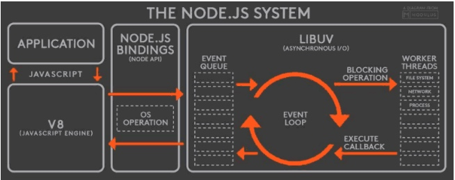

# 并发

## 高并发
如何实现高并发？

+  多线程 + 同步io
 一般而言大多数线程是阻塞在io上,这个时候为了处理更多请求通常是每来一个请求就起一个线程,但这样子会造成线程数多系统内存占用飙高。而且线程数在操作系统上对线程数又有限制
  
+  单线程 + 异步io (node.js)
 这个用单线程即请求来了主线程不停接收线程,请求封装成事件放入队列。具体案例可以看node.js的高并发模型
 http://www.cnblogs.com/onepixel/p/7143769.html
 

浅析 Node.js 单线程模型

Node.js采用事件驱动和异步I/O的方式，实现了一个单线程、高并发的Javascript运行时环境，而单线程就意味着同一时间只能做一件事，那么Node.js如何通过单线程来实现高并发和异步I/O？本文将围绕这个问题来探讨Node.js的单线程模型：

1、高并发策略

一般来说，高并发的解决方案就是提供多线程模型，服务器为每个客户端请求分配一个线程，使用同步I/O，系统通过线程切换来弥补同步I/O调用的时间开销。比如Apache就是这种策略，由于I/O一般都是耗时操作，因此这种策略很难实现高性能，但非常简单，可以实现复杂的交互逻辑。

而事实上，大多数网站的服务器端都不会做太多的计算，它们接收到请求以后，把请求交给其它服务来处理（比如读取数据库），然后等着结果返回，最后再把结果发给客户端。因此，Node.js针对这一事实采用了单线程模型来处理，它不会为每个接入请求分配一个线程，而是用一个主线程处理所有的请求，然后对I/O操作进行异步处理，避开了创建、销毁线程以及在线程间切换所需的开销和复杂性。

2、事件循环 ( Event Loop )

Node.js 在主线程里维护了一个事件队列，当接到请求后，就将该请求作为一个事件放入这个队列中，然后继续接收其他请求。当主线程空闲时(没有请求接入时)，就开始循环事件队列，检查队列中是否有要处理的事件，这时要分两种情况：如果是非I/O任务，就亲自处理，并通过回调函数返回到上层调用；如果是I/O任务，就从线程池中拿出一个线程来处理这个事件，并指定回调函数，然后继续循环队列中的其他事件。

当线程中的I/O任务完成以后，就执行指定的回调函数，并把这个完成的事件放到事件队列的尾部，等待事件循环，当主线程再次循环到该事件时，就直接处理并返回给上层调用。 这个过程就叫事件循环(Event Loop)，其运行原理如下图所示：

这个图是整个Node.js的运行原理，从左到右，从上到下，Node.js被分为了四层，分别是应用层、V8引擎层、Node API层 和 LIBUV层。

应用层：   即Javascript交互层，常见的就是Node.js的模块，比如 http，fs
V8引擎层：  即利用V8引擎来解析Javascript语法，进而和下层API交互
NodeAPI层：  为上层模块提供系统调用，一般是由C语言来实现，和操作系统进行交互
LIBUV层： 即Event Loop，是Node.js实现异步的核心，由LIBUV库来实现，而LIBUV中的线程池是由操作系统内核接受管理的。
在Node中，无论是Linux平台还是Windows平台，内部都是通过线程池来完成IO操作的，而LIBUV就是针对不同平台的差异性实现了统一调用。因此，Node.js的单线程仅仅是指Javascript运行在单线程中，而并非Node.js是单线程。

3、事件驱动模型

Node.js实现异步的核心是事件驱动，也就是说，它把每一个任务都当成事件来处理，然后通过Event Loop 模拟了异步的效果，为了更具体、更清晰的理解和接受这个事实，我们用代码来描述这个实现过程：

【1】定义事件队列

既然是队列，那就是一个先进先出(FIFO)的数据结构，我们用JS数组来描述，如下：

为了方便理解，我们规定：数组的第一个元素是队列的尾部，数组的最后一个元素是队列的头部，unshfit() 就是在队列尾部插入一个元素，pop() 就是从队列头部弹出一个元素，这样就实现了一个简单的事件队列。

【2】定义接收请求入口

每一个请求都会被拦截并进入处理函数，如下所示： 

这个函数很简单，就是把用户的请求包装成事件，放到队列里，然后继续接收其他请求。

【3】定义事件循环 ( Event Loop )

当主线程处于空闲时就开始循环事件队列，所以我们还要定义一个函数来循环事件队列： 

主线程不停的检测事件队列，对于IO任务就交给线程池来处理，非IO任务就自己处理并返回。

【4】处理I/O任务

线程池接到任务以后，直接处理IO操作，比如读取数据库：

当IO任务完成以后就执行回调，把请求结果存入事件中，并将该事件重新放入队列中，等待循环，最后释放当前线程，当主线程再次循环到该事件时，就直接处理了。

总结以上过程我们发现，Node.js只用了一个主线程来接收请求，但它接收请求以后并没有直接做处理，而是放到了事件队列中，然后又去接收其他请求了，空闲的时候，再通过Event Loop 来处理这些事件，从而实现了异步效果，当然对于IO类任务还需要依赖于系统层面的线程池来处理。因此，我们可以简单的理解为：Node.js本身是一个多线程平台，而它对JS层面的任务处理是单线程的。

4、CPU密集型是短板

至此，对于Node.js的单线程模型，我们应该有了一个简单而又清晰的认识，它通过事件驱动模型实现了高并发和异步I/O，然而也有Node.js不擅长做的事情：

上面提到，如果是I/O任务，Nodejs就把任务交给线程池来异步处理，高效简单，因此Node.js适合处理I/O密集型任务，但不是所有的任务都是I/O密集型任务，当碰到CPU密集型任务时，即只用CPU计算的操作，比如要对数据加解密(node.bcrypt.js)，数据压缩和解压(node-tar)，这时Node.js就会亲自处理，一个一个的计算，前面的任务没有执行完，后面的任务就只能干等着，如下图所示：

在事件队列中，如果前面的CPU计算任务没有完成，后面的任务就会被阻塞，出现响应缓慢的情况，如果操作系统本身就是单核，那也就算了，但现在大部分服务器都是多CPU或多核的，而Node.js只有一个EventLoop，也就是只占用一个CPU/内核，当Node.js被CPU密集型任务占用，导致其他任务被阻塞时，却还有CPU/内核处于闲置状态，造成资源浪费，因此，Node.js并不适合CPU密集型任务。

5、适用场景

RESTful API: 请求和响应只需少量文本，并且不需要大量逻辑处理， 因此可以并发处理数万条连接。
聊天服务: 轻量级、高流量，没有复杂的计算逻辑。

备注知乎上的大牛回答

作者：蔡磊
链接：https://www.zhihu.com/question/21461752/answer/27746958
来源：知乎
著作权归作者所有。商业转载请联系作者获得授权，非商业转载请注明出处。

来个我了解的优劣对比，没有哪个东西是绝对好的，nodejs没有看起来那么差，golang也没有看起来那么好，根据自己的需求选取吧。nodejs：内部是多线程，但是用户的代码全都执行在单个线程内，利用操作系统的non-blocking I/O来实现并发。好处：1. 单核心上，基本上这是速度最快的方案。2. runtime的核心实现起来比较简单，简单意味着容易维护，bug容易修正。坏处：1. 程序员的负担加大。很多人都难以适应层层递进的callback，好在还有一些库可以缓解。2. 某个任务如果执行CPU密集型计算，会阻塞其它任务。3. 单进程内无法利用多核。python :没深入研究过，不过由于GIL的存在，猜测跟nodejs应该是差不多的golang：最核心的压根就不是actor模式/CSP神马的，而是调度器。放在C++和其它任何高级语言里实现actor/CSP也是个非常简单的事，但要写个调度器则非常困难，golang/erlang帮你做了这一步。golang采用N:M方式进行任务调度。简单说就是程序启动时设定启用几个OS native线程（GOMAXPROCS），每个线程运行一个scheduler（由golang的runtime提供），程序运行时每个scheduler维护自己的task列表(goroutine），并进行调度。调度方式跟nodejs类似，遇到I/O时，把时间片让出来给其它任务使用。好处：1. 多任务的实现方式用了coroutine （cooperative tasking），用户的代码在逻辑上顺序放在一起，而无需分散到各个callback里。当coroutine/goroutine中执行I/O时，用户代码在“逻辑上”发生了block，但物理上已经yield control到scheduler代码中，scheduler会指派新的任务在当前的OS线程上执行。2. user space context switching，速度很快，占用的资源也很小。3. 单进程内很容易利用多核。坏处，或潜在的问题：1. golang帮用户做了不少事，所以不了解基本原理的用户很容易因误解而导致意想不到的后果。由于scheduler运行在user space，无法抢占式的(preemptive)调度任务，所以每个任务必须显式的yield才能出让时间片给其它任务，这个yield在golang标准库中都帮你做了，但如果你调用到C代码中然后进行阻塞式I/O（如果调用了第三方库，这个问题可能很难察觉），这个scheduler会因为无法得到时间片而堵死其上的所有goroutine。所以跟nodejs一样，执行CPU密集型的计算也会导致本scheduler上的所有goroutine发生阻塞。比nodejs好一点的是其它scheduler上的任务任然可以得以调度。要缓解这个问题，请在每计算出一些数据后调用runtime.Gosched()进行手工yield（这是典型的cooperative tasking，可以简单的理解为golang的标准库在每次执行I/O的时候，都自动帮你调用了这个方法，但在你自己的代码里，只能靠自己）。2. N:M的schduler实现起来太复杂，需要考虑的各种边边角角的情况太多。FreeBSD和NetBSD曾经都支持N:M的green thread调度，但后来都抛弃了这个方案改为更简单的1:1（就是我们现在普遍使用的OS native thread模型）。也就是说golang/erlang拾起了这个被操作系统抛弃的方案，实现到了语言里。想要稳定下来可能需要很长时间，可能还需要面对一些新的复杂性，比如现在服务器系统上的NUMA架构，要在其上实现一个高效的、无bug的work stealing scheduler（把另一个scheduler的任务拿过来放到自己这里运行，以防止资源浪费），那是相当难的，即便实现出来了，很可能在其它方面（比如性能）要做出很大的取舍。由于N:M方案存在很多取舍的问题，在某些场景下并不好使，rust在最近的几个版本中已经把N:M改为可选了，缺省是1:1方案。未来最好的并发方案还是让操作系统把native thread变的越来越轻量，从而彻底消除掉user-level的N:M scheduler，据说google已经对linux做了这么一个patch出来自己在用，且准备提交到upstream上去，但具体情况和时间未知。总的来说nodejs的方案是核心端轻，用户端重，golang/erlang正好反过来，把复杂性从用户身上转移到了语言实现里，这两种哲学目前还不好说谁更好谁更坏，golang/erlang总体看起来更好，但也有自己的缺点，这是要注意的。

参考资料：
https://www.zhihu.com/question/21461752
http://www.cnblogs.com/onepixel/p/7143769.html

